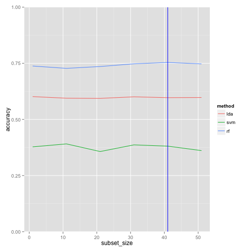

Human Activity Recognition Project
========================================================

In this report, I demonstrate the steps and approach I take to use the given data from **Human Acvtivity Recognition Project** to train a model and further predict the test data. I first preprocess the data, then apply feature selection and cross validation, then finally finalize the model and test on the provided testing dataset.

I expect a 70% accuracy and in the end Random Forest with 53 most referentiable variables achive this goal.

## Preprocess data

I first read in the training data and testing data:

```r
training <- read.csv("pml-training.csv", header=TRUE, sep=",", stringsAsFactors = FALSE)
testing <- read.csv("pml-testing.csv", header=TRUE, sep=",", stringsAsFactors = FALSE)
```

In total, there are 160 features in the training set. Then I take a look at whether the features of the training and testing sets are the same:

```r
sum(names(training) == names(testing))
```

```
## [1] 159
```
The one feature less is caused by training set having `classe` and testing set having `problem_id`. All the other 159 features are the same.

Also, the first 5 names are: `user_name`,  `raw_timestamp_part_1`, `raw_timestamp_part_2`, and `cvtd_timestamp`, which are not relevant for predicting the activity class, i.e. how well the activity is performed. The 6th feature is also not considered because they are categoritocal. Therefore, I take all of them out by doing the following: 

```r
keeps_train <- c(7:ncol(training))
training <- training[keeps_train]
testing <- testing[keeps_train]
```

Because the dataset contains a lot of empty cells, I fill the empty cells with `NA`. By doing so, it will be easier when we deal with missing values later.

```r
training[training == ""] <- NA
testing[testing == ""] <- NA
```

Then I remove all the features that include at least one missing value.

```r
training <- training[,colSums(is.na(training)) == 0]
testing <- testing[,colSums(is.na(testing)) == 0]
```

And don't forget to change the name of `training$classe` back to `classe` to make things easier.

```r
names(training)[length(names(training))] <- "classe"
training$classe <- as.factor(training$classe)
```

Then I want to check the number of features training and testing set each contain. Then take a look at what are the common features they both have after cleaning the missing values.

```r
ncol(training)
```

```
## [1] 54
```

```r
ncol(testing)
```

```
## [1] 54
```

```r
intersect(names(testing), names(training))
```

```
##  [1] "num_window"           "roll_belt"            "pitch_belt"          
##  [4] "yaw_belt"             "total_accel_belt"     "gyros_belt_x"        
##  [7] "gyros_belt_y"         "gyros_belt_z"         "accel_belt_x"        
## [10] "accel_belt_y"         "accel_belt_z"         "magnet_belt_x"       
## [13] "magnet_belt_y"        "magnet_belt_z"        "roll_arm"            
## [16] "pitch_arm"            "yaw_arm"              "total_accel_arm"     
## [19] "gyros_arm_x"          "gyros_arm_y"          "gyros_arm_z"         
## [22] "accel_arm_x"          "accel_arm_y"          "accel_arm_z"         
## [25] "magnet_arm_x"         "magnet_arm_y"         "magnet_arm_z"        
## [28] "roll_dumbbell"        "pitch_dumbbell"       "yaw_dumbbell"        
## [31] "total_accel_dumbbell" "gyros_dumbbell_x"     "gyros_dumbbell_y"    
## [34] "gyros_dumbbell_z"     "accel_dumbbell_x"     "accel_dumbbell_y"    
## [37] "accel_dumbbell_z"     "magnet_dumbbell_x"    "magnet_dumbbell_y"   
## [40] "magnet_dumbbell_z"    "roll_forearm"         "pitch_forearm"       
## [43] "yaw_forearm"          "total_accel_forearm"  "gyros_forearm_x"     
## [46] "gyros_forearm_y"      "gyros_forearm_z"      "accel_forearm_x"     
## [49] "accel_forearm_y"      "accel_forearm_z"      "magnet_forearm_x"    
## [52] "magnet_forearm_y"     "magnet_forearm_z"
```

So now I can really finalize the number of features in this dataset.

```r
features = intersect(names(testing), names(training))
n_features = length(features) # because the very last column is the y
```
Now I have 53 features left.

Before we finish the cleaning, add the `classe` labels back to the training set. Don't forget that tesing set does not need `classe` label (and they don't come with it either).

```r
training_subset <- cbind(training[, features], classe=training$classe)
training_subset$classe <- as.factor(training_subset$classe)
testing_subset <- testing[, features]
```

Due to the large size of training set (19622 rows), I decided to randomly sample 2.5% of the data to shorten the training time.

```r
training_subset <- training_subset[sample(1:nrow(training_subset), 400, replace=FALSE),]
```

## Explore features
After preprocessing and cleaning the data, I have 53 features, which are the predictors. Let's explore the dataset a little bit. Since the amount of features is still large, instead of exploring them all, let's do a **feature selection** by using a famous algorithm - *ReliefF*.

```r
library("FSelector")
weights <- relief(classe~., training_subset, neighbours.count = 5, sample.size = 20)
weights
```

```
##                      attr_importance
## num_window                 0.1039796
## roll_belt                  0.0238669
## pitch_belt                 0.0240885
## yaw_belt                   0.0269953
## total_accel_belt           0.0162485
## gyros_belt_x               0.0282627
## gyros_belt_y               0.0351463
## gyros_belt_z               0.0337567
## accel_belt_x               0.0072501
## accel_belt_y               0.0049263
## accel_belt_z               0.0128362
## magnet_belt_x              0.0054174
## magnet_belt_y              0.0342788
## magnet_belt_z              0.0231491
## roll_arm                   0.0415981
## pitch_arm                  0.0234598
## yaw_arm                    0.0289979
## total_accel_arm            0.0354312
## gyros_arm_x                0.0242091
## gyros_arm_y                0.0244467
## gyros_arm_z                0.0161131
## accel_arm_x                0.0336345
## accel_arm_y                0.0069472
## accel_arm_z                0.0216747
## magnet_arm_x               0.0520203
## magnet_arm_y               0.0233409
## magnet_arm_z               0.0314103
## roll_dumbbell              0.0545121
## pitch_dumbbell             0.0512717
## yaw_dumbbell               0.0309381
## total_accel_dumbbell       0.0237892
## gyros_dumbbell_x           0.0332648
## gyros_dumbbell_y           0.0205826
## gyros_dumbbell_z           0.0079526
## accel_dumbbell_x           0.0156751
## accel_dumbbell_y           0.0199945
## accel_dumbbell_z           0.0229970
## magnet_dumbbell_x          0.0317884
## magnet_dumbbell_y          0.0260001
## magnet_dumbbell_z          0.0480484
## roll_forearm              -0.0395220
## pitch_forearm              0.0284965
## yaw_forearm                0.0126083
## total_accel_forearm       -0.0014419
## gyros_forearm_x            0.0059141
## gyros_forearm_y            0.0649358
## gyros_forearm_z            0.0183667
## accel_forearm_x            0.0101978
## accel_forearm_y           -0.0131168
## accel_forearm_z            0.0259878
## magnet_forearm_x           0.0241394
## magnet_forearm_y           0.0005112
## magnet_forearm_z          -0.0013568
```

This step scores the **importance** of each feature and rank them according to the score. To pick the features that help the prediction, I want to rule out features with lower scores, even negative scores. To do so this systematically, I test the performances on different sizes of subsets. The algorithm I pick to do the prediction is **Support Vector Machine (SVM)**.

```r
library(caret)
library(FSelector)
accuracies_lda = c()
accuracies_svm = c()
accuracies_rf = c()
for (i in seq(1, n_features, by=10)){
  subset <- cutoff.k(weights, i)
  print(i)
  modelFit_lda <- train(classe ~ ., method="lda", data=training_subset)
  print("finish lda")
  modelFit_svm <- train(classe ~ ., method="svmRadial", data=training_subset)
  print("finish svm")
  modelFit_rf <- train(classe ~ ., method="rf", data=training_subset)
  print("finish rf")
  accuracies_lda <- c(accuracies_lda, modelFit_lda$results$Accuracy)
  accuracies_svm <- c(accuracies_svm, modelFit_svm$results$Accuracy[1])
  accuracies_rf <- c(accuracies_rf, modelFit_rf$results$Accuracy[1])
}
```

The following plot shows the performances on different size of subsets (I first start from combining the accuracies from three algorithms into one data frame):

```r
accuracies_lda <- data.frame(cbind(method = "lda", accuracy=accuracies_lda))
accuracies_svm <- data.frame(cbind(method = "svm", accuracy=accuracies_svm))
accuracies_rf <-  data.frame(cbind(method = "rf", accuracy=accuracies_rf))
accuracies <- rbind(accuracies_lda, accuracies_svm, accuracies_rf)
id <- rep(seq(1,55,10),3)
accuracies <- cbind(subset_size=id, accuracies)
accuracies$accuracy <- as.numeric(as.character(accuracies$accuracy))
library(ggplot2)
p <- ggplot(accuracies, aes(x=subset_size, y=accuracy, group=method, colour=method))
p + geom_line() + coord_cartesian(ylim = c(0, 1)) +geom_vline(xintercept = accuracies$subset_size[which.max(accuracies$accuracy)],data=accuracies,colour="blue")
```

 

As the plot above shows, when the size of subset is less than 30, the increase of accuracies as the size of subset increase is significant. However, it starts to slow down after it becomes larger than 30. The blue line in the plot indicates where the accuracy is the highest, which is 0.7537 when the size of subset is 41 and the method is rf (random forest). The maximum accuracy point is indicated on the plot with blue vertical line.

Therefore, I found the line to serve as the threshold of the amount of features to keep. So I make the new training set as the following.

```r
keeps <- c(1:accuracies$subset_size[which.max(accuracies$accuracy)])
training_subset <- data.frame(cbind(training_subset[,keeps],classe = training_subset$classe))
ncol(training_subset)
```

```
## [1] 42
```

## Model construction
Now let's try out using the pruned training set and tune the Random Forest model as our final model:

```r
library(caret)
modelFit_final <- train(classe ~ ., data=training_subset, method="rf")
modelFit_final
```

```
## Random Forest 
## 
## 400 samples
##  41 predictor
##   5 classes: 'A', 'B', 'C', 'D', 'E' 
## 
## No pre-processing
## Resampling: Bootstrapped (25 reps) 
## 
## Summary of sample sizes: 400, 400, 400, 400, 400, 400, ... 
## 
## Resampling results across tuning parameters:
## 
##   mtry  Accuracy  Kappa  Accuracy SD  Kappa SD
##    2    0.7       0.7    0.03         0.04    
##   21    0.8       0.7    0.03         0.04    
##   41    0.7       0.7    0.04         0.05    
## 
## Accuracy was used to select the optimal model using  the largest value.
## The final value used for the model was mtry = 21.
```

### Cross Validation
And I do cross validation to see the justified performance of this constructed model. This returns a list of all the predicted value.

```r
rfcv <- rfcv(trainx=training_subset[,-1], trainy=training_subset[,1], cv.fold=5, scale="log", step=0.5)
```

## Model evaluation
In the following, I use the testing dataset to evaluate the constructed model. Then I'm ready to do the prediction :D

```r
predict(modelFit_final, testing_subset)
```

```
##  [1] B A B A A C D C A A B C B A E B A A B B
## Levels: A B C D E
```
